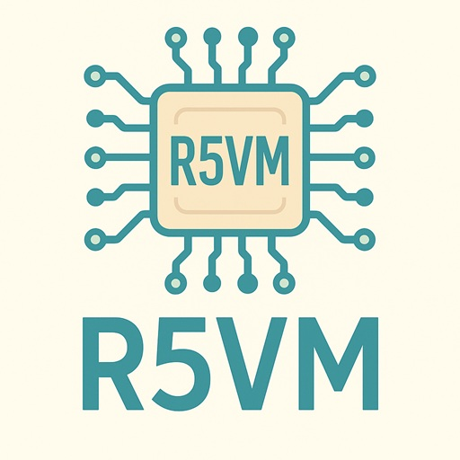

# R5VM — Minimal RISC-V RV32I Virtual Machine



*A compact and educational RISC-V emulator written in pure C.*


**R5VM** is a compact, educational **RISC-V RV32I** virtual machine written in pure C.
It can execute small RISC-V bare-metal programs compiled with e.g. `gcc` into flat binary images.

R5VM focuses on simplicity. Unlike WebAssembly (WASM) or full RISC-V emulators,
it’s small enough to read and understand in one sitting, making it ideal for
education, debugging, and embedding rather than speed or completeness.

To integrate R5VM into another project, just drop in `r5vm.c` and `r5vm.h` - no
additional dependencies or build steps required.

## Features

- Full **RV32I base instruction set**
  (R/I/S/B/U/J types, including LUI/AUIPC/JAL/JALR)
- Simple, portable C (C11) code (builds with GCC, Clang, or MSVC)
- Easy embedding into other projects
- No dependencies, freestanding-friendly
- Deterministic execution, ideal for testing and teaching

## Directory Structure

```
r5vm/
├── main.c          # host loader & runner
├── Makefile        # host build
├── r5vm.c/.h       # VM core
├── guest/
│   ├── main.c      # guest example
│   ├── r5vm.ld     # linker script
│   └── Makefile    # guest build
└── visualstudio/
    └── r5vm.sln    # Visual Studio 2022 project file
```

---

## Building the Host VM

### GCC / Clang
```bash
make
```

### Visual Studio (MSVC)

Open `visualstudio/r5vm.sln` and build/run the project in Visual Studio.

## Running a Guest Program

### Building and Running a Guest Program

A minimal RISC-V toolchain (e.g. `riscv64-unknown-elf-gcc`) is required.

**Note:** On Ubuntu, install the toolchain via:
```bash
sudo apt install gcc-riscv64-unknown-elf
```

Inside the `guest/` directory, the provided Makefile builds a flat binary:

```bash
cd guest
make
```

This produces:
- `vm.bin` - raw binary image (feed this to the host vm)
- `vm.elf` - ELF executable (in case you need it)
- `vm.dis` - disassembly (to analyze the assembler output)

### Run the Program in the VM

```bash
./r5vm guest/vm.bin
```

Optional: specify memory size explicitly
(e.g. 128 KiB instead of default 64 KiB):

```bash
./r5vm guest/vm.bin --mem 128K
```

### Example Output

```
[r5vm] program=18247 bytes (17.82 KiB), allocated=65536 bytes (64.00 KiB)
[r5vm] starting execution...
Hello, world!
[r5vm] finished, rc=127
```

---

## Error Handling and State Dump

When an error occurs (invalid instruction, memory fault, etc.),
`r5vm_error()` is called.
By default, it prints the error and a full CPU state dump before exiting.

Example output:
```
R5VM ERROR at PC=0x00000014: Unknown opcode (instr=0xFFFFFFFF)
---- R5VM STATE DUMP ----
 PC:  0x00000014
 x0: 00000000 x1: 00000000 x2: 00001000 x3: 00000000 ...
 MEM: 0x00000100 .. 0x000100FF (65536 bytes = 64.00 KiB)
--------------------------
```

You can override the error handler by defining your own `r5vm_error()`.

---

## Guest Linker Script (`r5vm.ld`)

The guest program is linked into a single flat 64 KiB RAM image:

```ld
MEMORY {
    RAM (rwx) : ORIGIN = 0x00000000, LENGTH = 64K
}
```

The resulting `.bin` file represents the entire memory image from address 0x0000 upward.
The VM loads it directly into its allocated memory buffer.

---

## License

MIT License - free for educational and commercial use.
(c) 2025 Jan Zwiener, all rights reserved.

